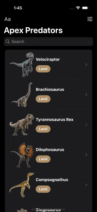

# JPApexPredators

JPApexPredators is a fun learning project where we build a Jurassic Park–themed list app featuring the most iconic and feared apex predators from the franchise.

The purpose of this app is to practice and demonstrate key iOS development concepts, including:
- Building and managing lists
- Adding sorting, filtering, and search functionality
- Implementing animations
- Using MapKit for location-based features
- Applying separation of concerns and clean coding practices

# Demo

Here’s a quick look at the app in action:

